# Project 4 - The Checklistar

[The Checklistar live demo](https://the-checklistar.herokuapp.com/)\
[The Checklistar repository](https://github.com/jannis-kiriasis/the-checklistar)

## Table of contents
-  [Introduction](#introduction)
-	[User Experience (UX)](#user-experience-ux---user-stories)
-	[Features](#features)
-	[Where user stories meet features](#where-user-stories-meet-features)
-	[Wireframes](#wireframes)
-  [Features left to implement](#features-left-to-implement)
-	[Designs](#design)
-  [Accessibility](#accessibility)
-  [SEO](#seo)
-  [Planning](#planning)
-  [Data model](#data-model)
-	[Technologies and tools used](#technologies-and-tools-used)
-	[Testing](#testing)
-	[Issues fixed](#issues-fixed)
-	[Known bugs](#known-bugs)
-	[Deployment](#deployment)
-  [Acknowledgements](#acknowledgements)

## Introduction

The Checklistar is a workflow management application designed to bring projects from A to Z.

Documents and projects more often than not, need to be reviewed and approved by several departments before they can 'go live'.

The larger the company and the longer this process normally takes. 

Let's say for example that we want to create a new advertising campaign for our brand-new product. The marketing team will come up with the campaign but what about the other teams?

The product team probably needs to review the campaign to confirm that the feature advertised are correct.

The legal and compliance departments need to ensure that the campaign adheres to internal and external regulations.

The campaign may also need the review of an executive.

And obviously, everyone has comments and edits.

The Checklistar takes away the pain of following up with every team, digging into email threads and recording evidence of approvals (yes there is also the risk management team).

Does it sound familiar to you?

You are not alone.

A quick search with Google Keywords Planner can reveal how many monthly searches there are for 'workflow management system' and related queries.

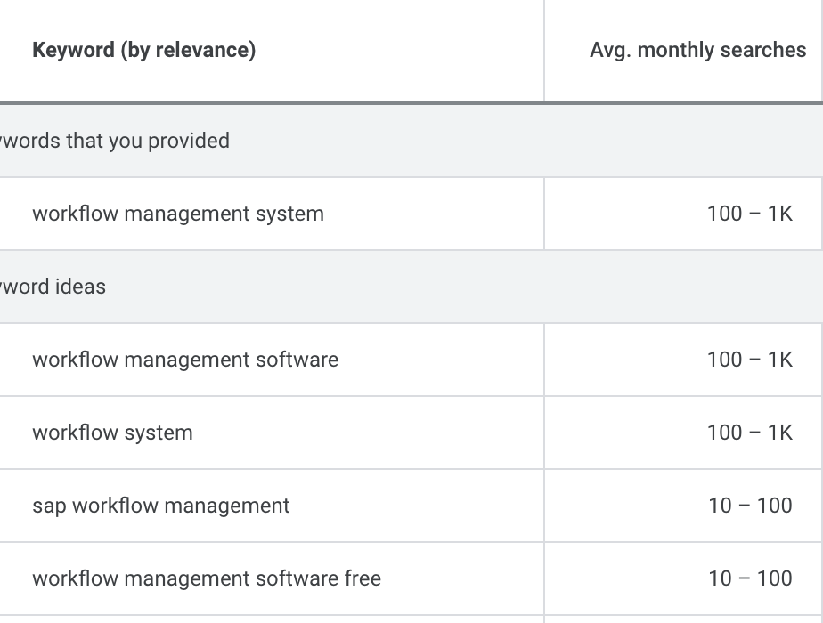

This is what you can do with The Checklistar:
1. Start a project, set and follow the stages it needs to go through.
2. Set the 'approvers', the people or the teams in your organization who need to review the project or document.
3. Receive feedback from the approvers in form of comments, to keep the messages around one project/document in the same place.

### Who is The Checklistar for?
The checklistar is for those companies that need a desktop app to track progress on multiple cross-team projects or documents approval.

### What The Checklistar offer:
- A simple form to set up a project and approvers who need to review it.
- A unified view to see all the projects open.
- A view to see all the projects the logged-in user has started.
- A view to see all the projects the logged-in user needs to approve.
- A form to leave comments under each project.
- The possibility to edit and delete projects.

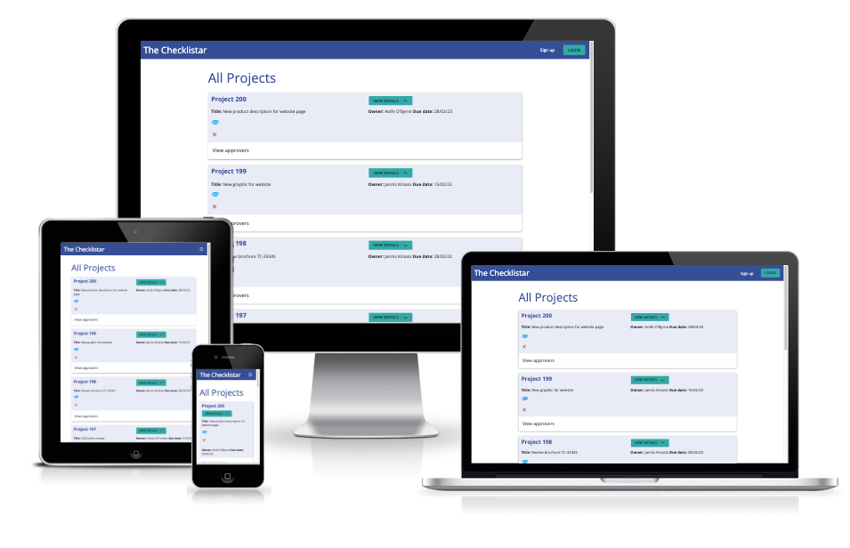  

## User Experience (UX) – The needs
Now that we are familiar with The Checklistar target audience and offering, we are looking at the needs the app users may have. 

I have identified 3 main stakeholders:

### The project manager (PM)
The project owner is the person who owns the project and is responsible to bring it to a conclusion. 

The project owner had different requirements since the beginning depending on the type of project that needs to be completed. 

To summarise, a project or document that needs to ‘go through the checklist’ (from here the name The Checklistar) always has:
- A title
- A description
- An attachment
- A due date
- The departments that need to approve it
- An aimed approval due date for each department to make sure the process doesn’t stop somewhere

Not every project goes smoothly through the checklist every time. The PM faces different struggles:

1. Some approvers forget to follow up and return the project approved on time. They are always busy, they (we) always get thousands of emails every day and the email with the project approval request gets forgotten under a pile of other urgent emails. The PM needs to remind the approvers constantly.

3. Some approvers come back with suggestions or change requests. The project/document needs to be reviewed. The approver and the project owner start to exchange many emails back and forth. Someone else may be called in to approve the project too.

4. The PM also needs to collect evidence of every approval. All the approvals are recorded in case of an audit from third parties. The risk controllers regularly test a few projects to make sure that the company is limiting the risks as much as possible. The PM problem is that those approvals aren’t saved in a database, but in their mailbox. So they need to go and find all the email threads (from point 2) and keep a record of all the approval received. 

5. Deadlines are missed because of points 1,2,3. The project owner is considered responsible because it’s ‘the owner’.

### The project approver (PA)
The project approver is the person that needs to review and approve a project. Every project may have more than one approver. Usually, the approvals need to be given in a specific order.

The PA also faces different problems:

1. The PA receives many requests for approvals per week. Some of them take longer than others to review. The PA is usually one designated person in a department. It’s difficult to keep track of all the approval requests if the only place they are found is their mailbox.
2. The PA needs to be always aware of the approval deadlines. Because it is difficult to keep up with all the incoming requests, the approver must be aware of all the deadlines. Some of the documents/projects are time-sensitive, and others may be regulatory changes. 

### The risk controller (RC)
The risk controller is someone that oversees the process from the outside. The RC isn’t actively involved, however, they periodically ‘test’ the process. They have to make sure that all the projects/documents completed went through the checklist rigorously and that the approvals needed have been recorded.

Even if not actively involved, the RC also faces some problems:

1. While performing the tests, the RC needs to review all of the approval recordings. They need to examine the evidence provided. That evidence may be different from project to project. Every PM also collects them differently. The RC issue with this is that it’s time-consuming and not immediate the answer. The RC may have to knock at the PM door to ask for explanations about the evidence collected because not clear enough.
1. The RC also needs to evaluate the quality of the evidence and decide whether it is satisfactory for risk control. This means that the RC needs to influence the way the checklist is compiled and the way the evidence is recorded. Again this process takes time as it isn’t standardised.

The first step was to outline all the problems the 3 main stakeholders have. Those problems were then translated into needs, in other words, the stakeholders ‘wants’ from the approval management system.

The app needs to be able to solve all of them. The following step I took was to transform those needs into Epics and then User stories.

At this point defining the epics was intuitive enough: I created 3 main epics, each of them addressing the issues of one of the stakeholders.

## Epics and User Stories

Following, you can find the epics and the user stories breakdown used to plan the development of the app.

### Epic 1 – The project manager

The PM requires a workflow to get some projects/documents approved. 
The PM needs to be able to submit certain information with the project/document. The PM needs to designate some approvers within the organization to review and approve the project. The PM needs to keep track of all the interactions with the PAs and collect approvals within certain deadlines. The approval evidence needs to be recorded for risk management reasons.

### E1 - User story 1 – Create a project
As a PM, I want to be able to create a project so that I don’t need to submit the project via email.

Acceptance criteria:
1. The project needs to include a project id, title, description, attachment, due date and an unlimited number of approvers.

### E1 - User story 2 – Set the project workflow
As a project manager, I want to be able to assign unlimited approvers to a project so that I can get all the approvals needed for completion.

Acceptance criteria:
1. Set unlimited approvers when I’m creating the project
2. The approvers must be associated with a department and have a deadline

### E1 - User story 3 – Create the main dashboard
As a project manager, I want to be able to see at what stage a process is and how many steps are missing so that I can make sure we are in line with deadlines.

Acceptance criteria:
1. Create a dashboard page with all the projects open and the approvals required for each project
2. The approvals must be ordered by the due date
3. It should be immediate to notice what approvals have been given and what approvals are missing

### E1 - User story 4 – Edit a project
As a project manager, I want to be able to update a project anytime, so that if the requirements change, I can update the workflow.

Acceptance criteria:
1. Project title, description, due date approvers and approval due dates must be editable.
2. Only the project owner can edit a project.

### E1 - User story 5 – Delete a workflow
As a project manager, I want to be able to delete a project, so that if a project is cancelled, I can also delete it from the platform.

Acceptance criteria:
1. Include the option to cancel a project and related approvers.
2. Only the project owner can delete a project.

### E1 - User story 6 – See all the projects open
As a project manager, I want to be able to see all the projects I’ve started and their approvers, so that I can quickly see where I need to focus.

Acceptance criteria:
1. Create a page where the PM can see only the projects the logged-in PM has started
2. Make instantly evident what projects are completed and what aren’t
3. The projects should be ordered by created date

### E1 - User story 7 - Add a comment (Create)  
As a project manager, I can add a comment to a specific project, so that I can update other people or discuss a specific issue without sending emails.

Acceptance criteria:
1. Projects should be comment-able 
2. Comments should be in a thread and ordered by the newest

### E1 - User story 8 - Notify PM
As a PM, I want to be notified when a comment is added to the project, or approval is given so that I can decide how to proceed next

Acceptance criteria:
1. Send me a notification when a project is approved
2. Send me a notification when a project is commented

### E1 - User story 9 - Registration and sign-in project owner
As a project owner, I can register and log in to the software, so that I will be the only one able to create, edit, complete and cancel my projects.

Acceptance criteria:
1. Users need to be able to sign up to use the app.
2. PM must be authenticated to create, edit, cancel or complete a project.

## Epic 2 – The approvers/stages
The approvers need to be able to find all the projects they need to approve easily. They’ll have a list of works they need to review so that nothing goes lost and they can make sure deadlines are respected. The approver needs to be able to comment on and approve projects.

### E2 - User story 1 - See projects pending approval (Read) 
As an approver, I want to quickly see what projects are pending my approval so that I can concentrate and get the work done.

Acceptance criteria:
1. All the approvers’ projects need to be on a page and the deadline should be visible.
2. The projects needing approval by the logged-in approver need to be identified easily.

### E2 - User story 2 - See projects by the due date
As an approver, I want to see when all the projects pending my approval are due so that I can prioritise my work.

Acceptance criteria
1. The due date will be visible in the dashboard, my approvals and my projects views for each project.
2. The My approvals view will be ordered by the due date.

### E2 - User story 3 - Approvers feedback
As an approver, I want to be able to add a comment to the project, so that I can record my feedback and don’t get lost in email threads. 

Acceptance criteria:
1. The approver needs to be able to comment on the project

### E2 - User story 4 - Approve a project
As an approver, I want to be able to approve a project so that it can be sent to the next approver.

Acceptance criteria:
1. A feature needs to allow the approver to approve the project
2. Only the approver specified by the project manager can approve a project

### E2 – user story 5 - Notify approvers
As an approver, I want to be notified when a project is assigned to me so that I can take an action.

Acceptance criteria:
1. The approver needs to receive a notification when he has been assigned a project.

### E2 – user story 6 - Registration and sign approvers
As an approver, I can register and log in to the software, so that I will be the only one able to approve a project for my department.

Acceptance criteria:
1. Users need to be able to sign up to use the app.
2. Approvers must be authenticated to approve a project.

## E3 – The risk controllers

The tool will allow risk controllers to keep track of all the work done and make sure that it has been carried out respecting regulations to lower risk levels. The tool records all the projects/ works done and the evidence should be collectable easily.

### E3 - User story 1 - The risk controller
As a risk controller, I can download a list of the projects approved, so that I can record risk assessments and evidence.

Acceptance criteria:
1. The RC needs to find a list of all the projects approved.
2. The completed projects need to be accessible easily.
3. Completed projects and approvals need to be downloadable

Mapping out the user stories helped me easily identify the problems the application solves:

- There is no need to save/download approval emails as they are all stored in a database
- The RC can find all projects completed easily and download all the approvals from the database
- There is no need to exchange emails as the projects can be commented on.
- Everything related to a project is centralised. So comments, approvals, deadlines and other project details can be found in the same place.

## Features

In the following paragraphs, we are going to see what features appear on the website and where they meet the users' needs.

### 1. Main navigation

   The main navigation includes the following pages:
   - Create a project
   - Dashboard – contains all the projects opened by anyone 
   - My projects – the projects the logged-in user has started
   - My approvals – the approvals the logged-in user needs to give
   - Notification centre – a list of things that happened related to the logged-in user

The navigation allows users to filter the projects to easily find the projects they need to approve, and started and the option to create a project. 

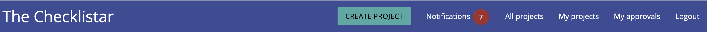  

Non-logged-in users can only see sign-up and sign-in in the navigation.  

  

### 2. The projects

The project includes the project details that the PM outlined. It also includes the approvers that need to approve it and their approval due dates.

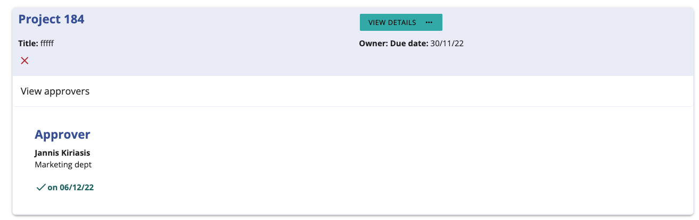  

The content seen is personalised for the signed-in user. On the ‘My approvals’ page, if the logged-in user has already approved the project, it will have a green background (otherwise light blue)

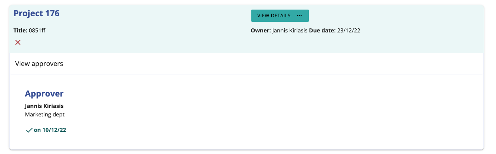  

On the ‘my projects’ page, if the logged-in user has already completed a project, it will have a green background (otherwise light blue).

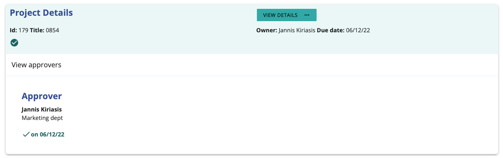  

### 3. The project details

By clicking on view details on any project, it will open a project details page. There everyone can see more details about a project as well as its comments and the buttons to edit, approve, delete and complete. It also includes the form to submit a comment on the project.

Only the PM can see edit, delete and complete. Only the approvers can see the approve button and only their correspondent button.

The defensive design has been implemented to approve, complete and delete a project. The user will need to confirm twice before to complete those actions.

Page feedback has been implemented when a project is approved, completed, deleted or updated.

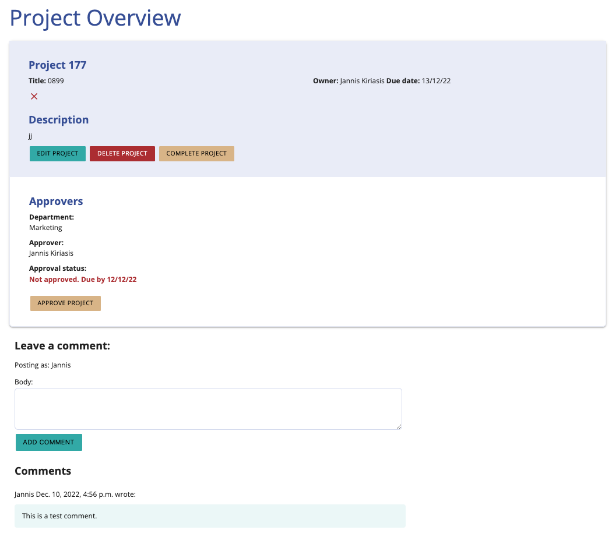  

### 4. My projects

The 'my projects' view filters the projects by projects opened from the logged-in user. The projects are also divided between completed and not completed. The projects completed have a light green background whereas the projects not completed have a light blue background.

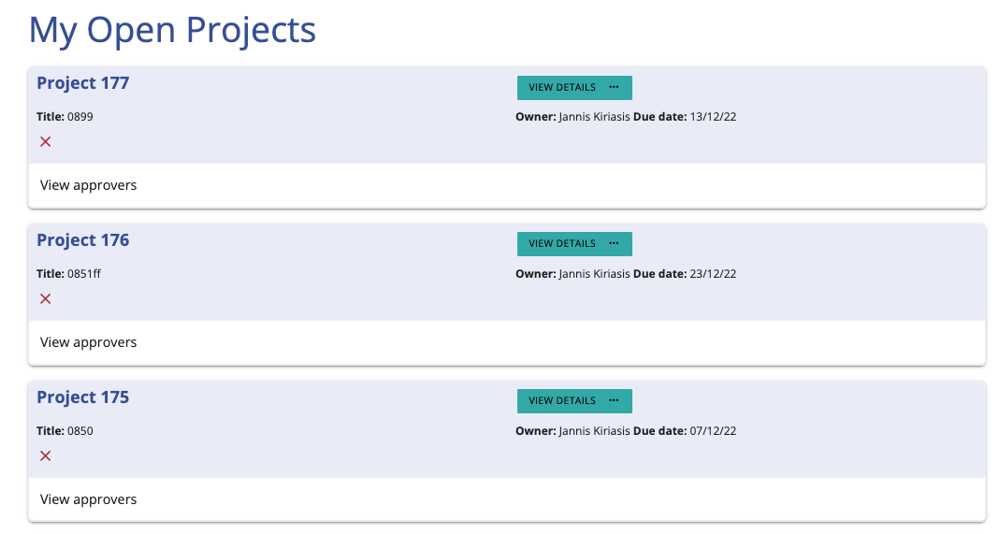  

### 5. My approvals

The 'my approvals' view filters the projects by projects that the logged-in person needs to approve. The projects are also divided by approved and not approved. The projects approved have a light green background and the projects not approved have a light blue background.

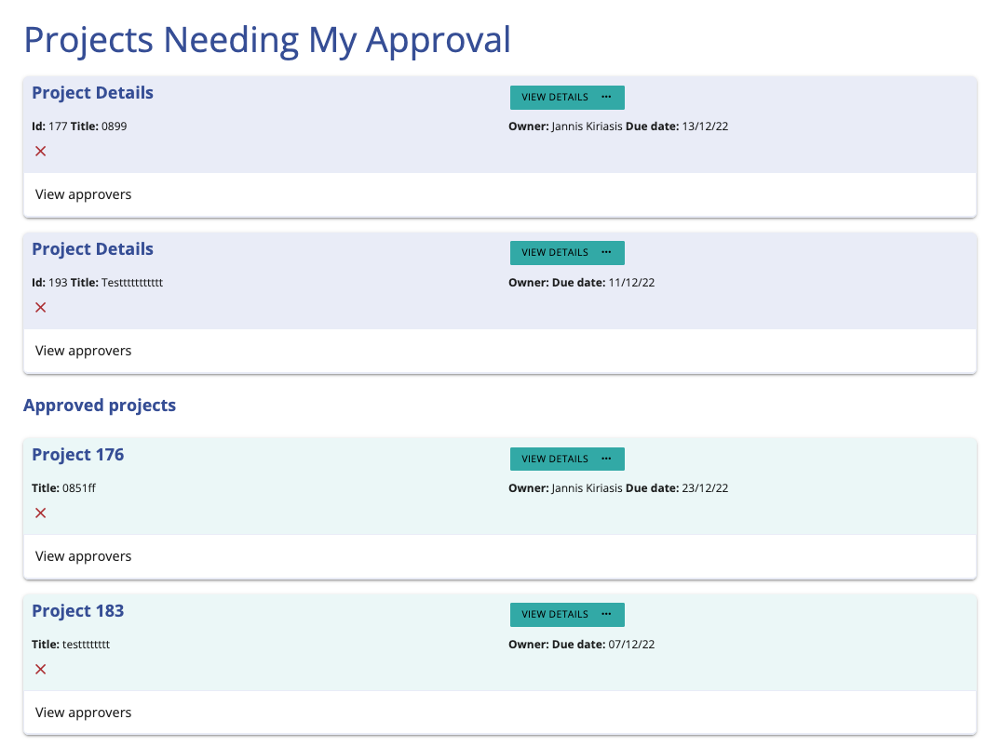  

### 6. Notification centre

The notification centre includes a list of notifications personalised for the logged-in user. The user is notified when:

- a comment is added to a project where the user is an approver or a project owner
- a project is assigned to an approver
- a project has been approved

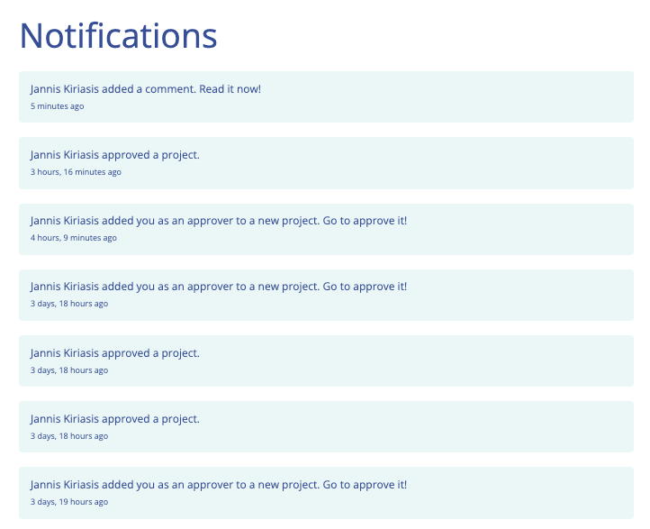  

### 7. Create and edit a project forms

As the title says, this form allows the user to create or edit a form. Every field is editable. Approvers can be added and removed during creation or when editing a project and the records are automatically added or removed from the database.

Page feedback has been implemented when a project is created and updated.

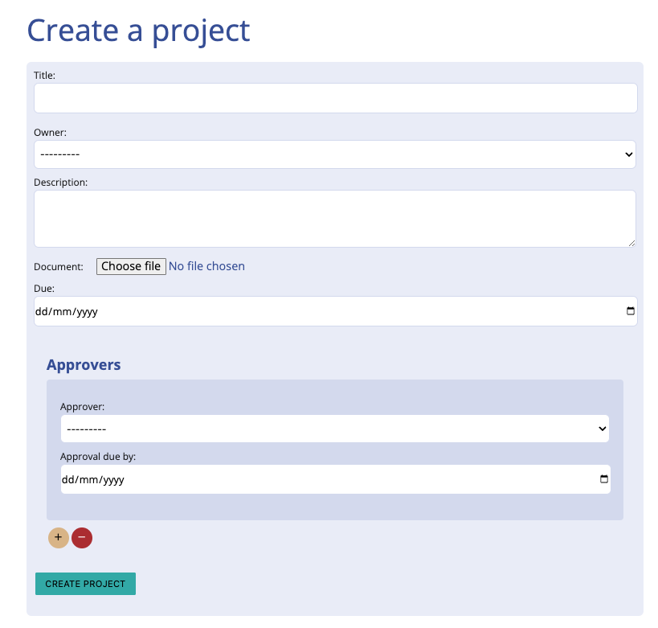  

### 8. Login

A form to authenticate the user to the app. A non authenticated user who tries to navigate the site will always be redirected to the sign in page.

Page feedback has been implemented when a user logs in and signs up.

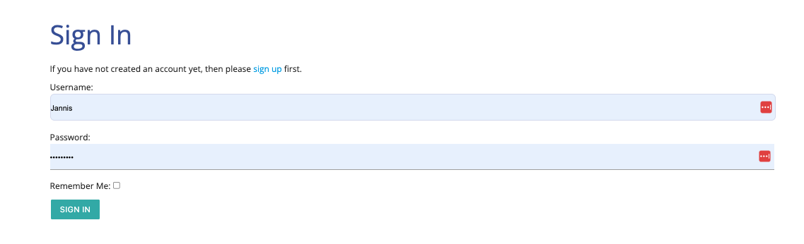  

### 9. Signup

The signup form allows users to sign up and use the tool. At sign-up, they need to enter their department so that if they are selected as approvers, their department will show up in the approvers' list of each project.

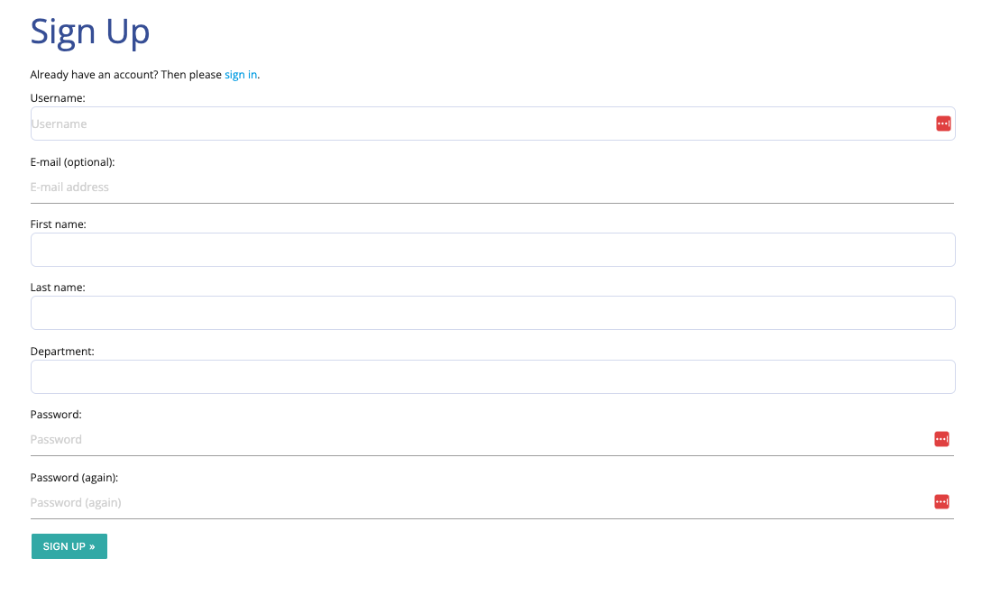  

### 10. The admin panel

The admin panel allows a superuser to see all the records saved in the database including:

- projects
- project approvals
- users and user profiles
- Notifications
- comments

From the admin panel, projects and project approvals can be downloaded as a CSV file to be handed to the RC and fulfil their requirements.

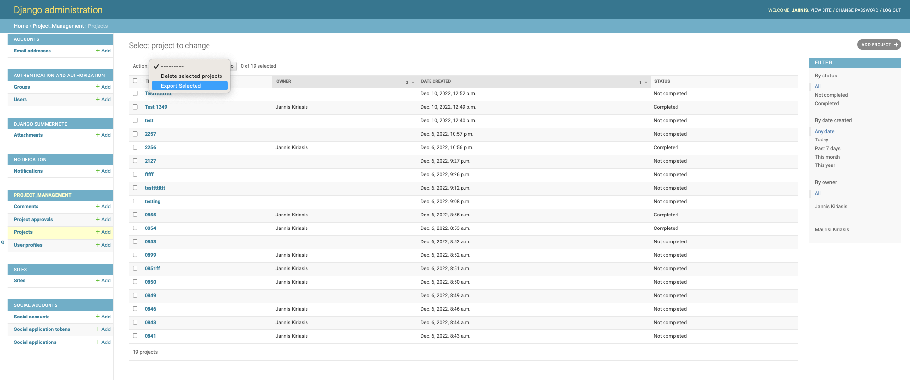  

### 11. Feedbacks and popups

The application let the users know every time they perform an action whether it has been completed or not.

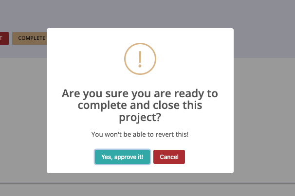  

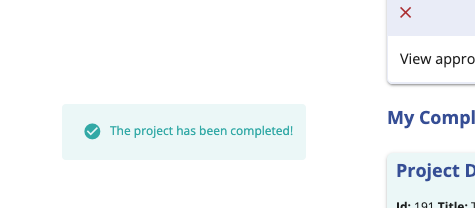  

### 12. 404 and 500 error pages

The 404 and 500 error pages handle errors nicely explaining to the user what is happening and offering a way to exit the error.!

[Custom 404 page](./media/README-files/404.png)  

## Where user stories meet features

In the following table, I’m going to match features with user stories and the issues the app solves. All the user stories, features and needs outlined in the paragraphs above have a number that corresponds to the number you see in the table below.

| User stories | Features |
|--------------|----------|
| E1 US1 - Create a project       | 7, 11        |
| E1 US2 – Set the project workflow      | 7        |
| E1 US3 – Create main dashboard      | 2, 3     |
| E1 US4 – Edit a project      | 7, 11        |
| E1 US5 – Delete a workflow      | 3, 11        |
| E1 US6 – See all the projects open      | 4        |
| E1 US7 - Add a comment (Create)      | 3, 11       |
| E1 US8 - Notify PM      | 6        |
| E1 US9 - Registration and sign in project owner      | 8, 9     |
| E2 US1 - See projects pending approval (Read)      | 5        |
| E2 US2 - See project by due date      | 5, 3     |
| E2 US3 - Approvers feedback      | 3        |
| E2 US4 - Approve a project      | 3, 11        |
| E2 US5 - Notify approvers      | 6,        |
| E2 US6 - Registration and sign approvers      | 8, 9     |
| E3 US1 - The risk controller      | 10       |

## Wireframes

The first draft of the website was completed by creating wireframes using Balsamic.

Below you can find the initial wireframes created. The main goal when I created 
the wireframes was to fulfil the user story requirements. Later on during the development
I've upgraded the styling getting to the final version that you see live.

**Create a project**  
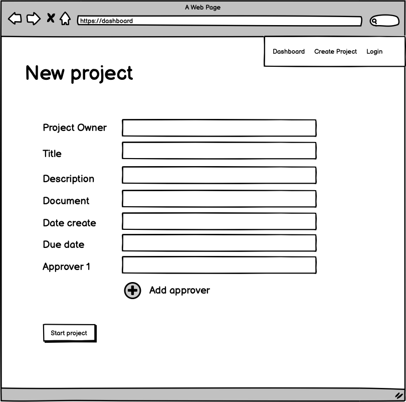  

**Dashboard**  
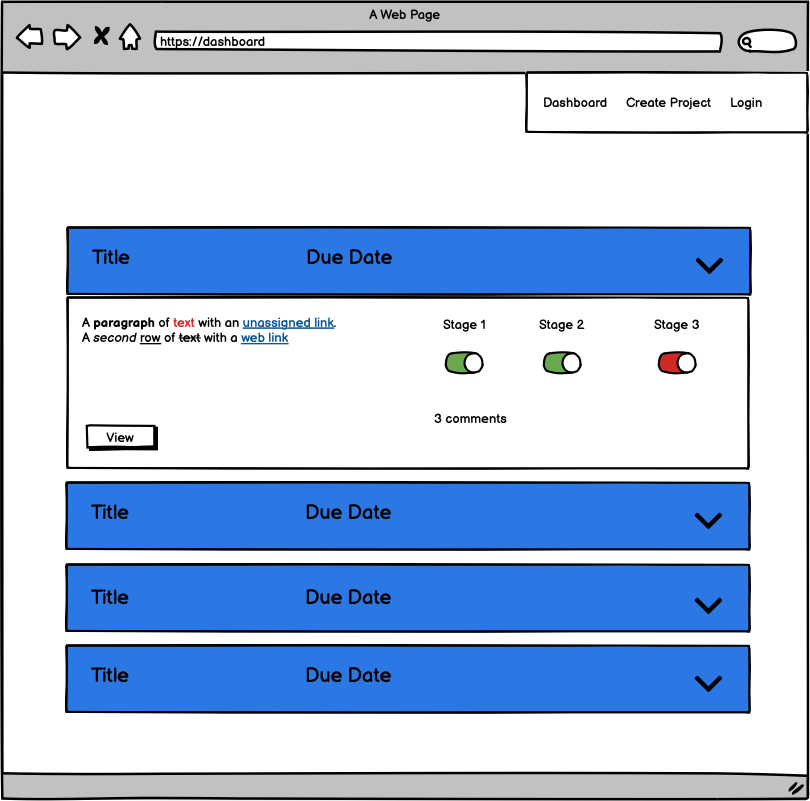  

**View details**  
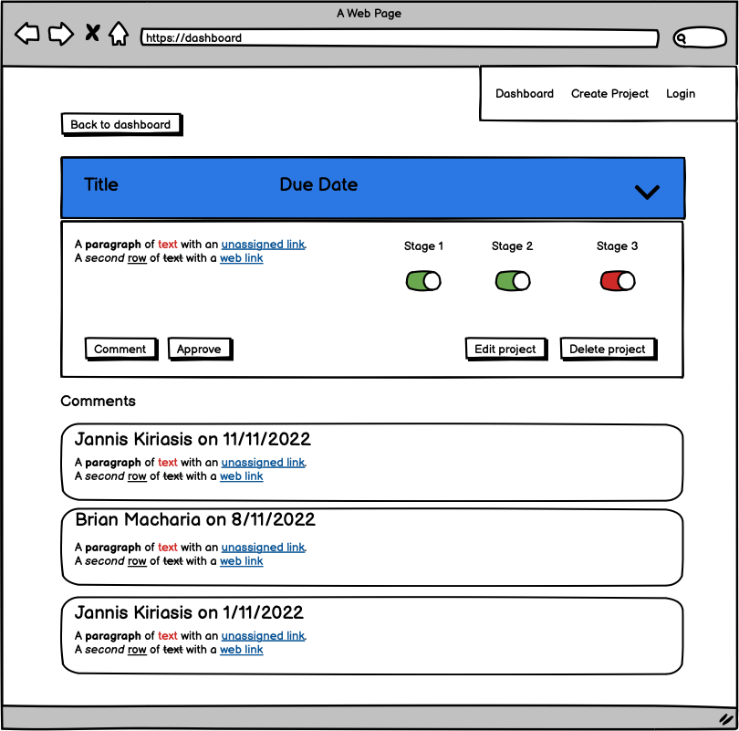  

## Features left to implement 

- Create checklist templates. A set of predefined approvers. Every template has differently predefined approves. Improves UX.
- Implement email notifications. When a notification is created, an email can also be created.
- Option to upload more than 1 document. Possibly a versioning system.
- Approvals are to be given in a specific order, so disable the approver button until the approver's turn comes.
- Signup with a social media account or Google.

## Design

In the following paragraph, I'm going to explain the colours, typography and imagery choices.

### Colours

I've used a similar colour palette to a project I previously realised (pp2) so the reasoning behind the colour choice is very similar.

The main colour used is a shade of blue (Liberty). Blue is a calm and serene colour. It is often associated with stability and reliability. I've increased a bit the contrast ratio with light backgrounds to achieve accessibility best scores.

All the main buttons are in a shade of green, Verdigris. It's different enough to differentiate from the main Liberty colour. I've also used a share of red (Fuzzy Wuzzy) for the 'delete' button and the 'remove approver' button.

I've also used a tan colour for the 'edit', 'complete' and 'approve'. Those aren't standard actions (for which I've used Verdigris) and they aren't 'delete' actions so Fuzzy Wuzzy red wasn't a good choice for those. 

Lighter shades of Verdigris and Liberty have been created to highlight complete/non-completed and approved / not approved projects in the templates 'dashboard', 'my approvals', 'my projects'.

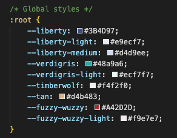  

All the text colour combinations have been tested for accessibility and they all achieve WCAG AAA.
- [Colour contrast test: white on blue](https://webaim.org/resources/contrastchecker/?fcolor=FFFFFF&bcolor=3B4D97)   
- [Colour contrast test: black on light blue](https://webaim.org/resources/contrastchecker/?fcolor=000000&bcolor=E9ECF7)   
- [Colour contrast test: black on green](https://webaim.org/resources/contrastchecker/?fcolor=000000&bcolor=48A9A6) 
- [Colour contrast test: white on red](https://webaim.org/resources/contrastchecker/?fcolor=FFFFFF&bcolor=A42D2D)   
- [Colour contrast test: black on tan](https://webaim.org/resources/contrastchecker/?fcolor=000000&bcolor=D4B483)   
- [Colour contrast test: blue on light blue](https://webaim.org/resources/contrastchecker/?fcolor=E9ECF7&bcolor=3B4D97)   
- [Colour contrast test: black on tan](https://webaim.org/resources/contrastchecker/?fcolor=000000&bcolor=D4B483)   
- [Colour contrast test: dark green on white](https://webaim.org/resources/contrastchecker/?fcolor=296161&bcolor=FFFFFF)   

Tested with [Contrast checker](https://webaim.org/resources/contrastchecker/).

### Typography

The typography was chosen for my liking, again I've used it in previous projects PP2). Open Sans is a very popular font if not the most popular.

I used [Open Sans](https://fonts.google.com/specimen/Open+Sans) for all body elements.  

The fallback font used is Helvetica for all body elements.

### Imagery

The only image used in this project is the favicon.

## Accessibility

As mentioned above, all the colour combinations used for text passed a contrast ratio test. During the testing phase, Verdigris didn't pass the test and so it was darkened creating the Dark Verdigris colour achieving the WCAG AAA score for accessibility.

I've also used alt tags to describe images and aria labels to describe links.  
The pages have been structured using semantic HTML markup.  

## SEO

While the most important SEO meta tags have been used in the base.html template head, this app is for internal use, so it isn't made to be found on search engines. 
SEO is irrelevant to this project.

## Planning

To build this app I've used [Jira](https://kiria.atlassian.net/jira/software/c/projects/TC/boards/2/backlog?view=detail&selectedIssue=TC-154&issueLimit=100) as an agile tool. 

The development took 5 sprints of different lengths in terms of days but with similar total story points (around 25-27 per sprint).

The tasks in each sprint were prioritised using the moscow method and the priority settings in the task details. With the moscow method, user stories and tasks are categorised in: Must do, Should do, Could do, Won't do.

In every sprint, about 60% of the user stories had a priority level of Must do or Should do. The remaining 40% was Could do or Won't do.
Many of the tasks and user stories that were marked as won't do in a sprint, were marked as should do or must do in the following sprint.

You have probably seen the epics and user stories few paragraphs above. They are also available in the Jira board.

## Data model  
For this app, I've created 5 data models and inherited others from Django Allauth.

In this paragraph I'm going to focus on the data models I've created and the most important inherited ones.

For more details on all the fields and models available and their relations, you can view this [database schema](/media/README-files/data-schema.svg).

**User model**  
The User model contains all the generalities of the app users, including:
- username
- first name
- last name
- email address
- password

**UserProfile model**  
The UserProfile model extends the User model. Any extra fields related to a user are in the UserProfile.
Between a User and a UserProfile, there is a one-to-one relationship where the user is the connection.

The UserProfile includes:
- user (1to1 relation with User)
- department

**Project model**  
The Project model includes all the information related to a project.
Between a project owner and a User, there is a one-to-many relationship because a user can have many projects but a project owner belongs to one project.

The Project model includes:
- title
- slug
- description
- document
- owner (FK to User)
- date created (when the project was created)
- status (the project is completed or not)
- due (project due date)

**ProjectApproval model**  
The ProjectApproval model includes all the information related to the approval required for a project.
One project can require many approvals, however, one approval belongs only to one project.
One user can give many approvals, however one project approval belongs only to one user.

The ProjectApproval model includes:
- project (FK to Project)
- Approver (FK to UserProfile)
- Approval due by (Approval deadline)
- Approved date (When the approval was given)
- Created on (when the approval request was created)
- Approved (True if approved, false if not)

**Comment model**  
The Comment model includes all the information related to a comment left on a project.
One comment belongs to a project only, however, a project can have many comments.

The Comment model includes:
- Project (FK to Project)
- Body (Comment body)
- Created on (When the comment was created)
- Email 
- Name (Name of the user)

**Notification model**  
The Notification model includes all the information related to a notification send after an action has been taken.
These actions can be comments, approvals given and approval requests sent. 
One notification belongs to one user, however, one user can send many notifications.
One notification is received by one user, however, one user can receive many notifications.

The Notification model includes:
- Created by (FK to User)
- To user (FK to User)
- Created at (When the comment was created)
- extra id 
- is read (The notification is read or not)
- notification type (the type of notification, comment or approval or approval request)

For more information on the field types and the relations between models, view this [database schema](/media/README-files/data-schema.svg).

## Technologies and tools used

- [HTML5](https://en.wikipedia.org/wiki/HTML5)
- [CSS3](https://en.wikipedia.org/wiki/CSS)
- [JavaScript](https://it.wikipedia.org/wiki/JavaScript)
- [Python](https://www.python.org/)
- [Django](https://www.djangoproject.com/)
- [Materialize](https://materializecss.com/)
- Version control: [Git](https://git-scm.com/)
- Public repository: [GitHub](https://github.com/)
- Google Font: [Open Sans](https://fonts.google.com/specimen/Open+Sans)
- Wireframes: [Balsamiq](https://balsamiq.com/)
- Colours accessibility: [Webiam](https://webaim.org/resources/contrastchecker/)
- Uniform alert on all browsers: [SweetAlert](https://sweetalert2.github.io/)
- Colors darkener: [Color darkener](https://mdigi.tools/darken-color/)
- Color lightener: [Color lightener](https://mdigi.tools/lighten-color/)

## Testing

I've carried out the following tests:

1. [HTML validation](#html-validation)
2. [CSS validation](#css-validation)
3. [JavaScript validation](#js-validation)
9. [Automated python testing](#automanted-teting)
4. [Manual testing](#manual-testing)
5. [Browsers compatibility](#browser-compatibility)
6. [Responsiveness testing](#responsiveness-testing)
7. [User stories testing](#user-stories-testing)

### HTML validation

All the pages passed the HTML validation with no errors or warnings.
- [account/signup.html](./media/README-files/signup-w3c.pdf)  
- [account/login.html](./media/README-files/signin-w3c.pdf)  
- [account/signout.html](./media/README-files/signout-w3c.pdf) 
- [dashboard.html](./media/README-files/dashboard.pdf)  
- [my-projects.html](./media/README-files/my-projects-w3c.pdf)  
- [my-approvals.html](./media/README-files/my-approvals-w3c.pdf)  
- [project-details.html](./media/README-files/my-projects-w3c.pdf)  
- [create-project.html](./media/README-files/create-project-w3c.pdf)  
- [edit-project.html](./media/README-files/edit-project-w3c.pdf)  
- [400.html](./media/README-files/edit-project-w3c.pdf)  
- [notifications.html](./media/README-files/notifications-w3c.pdf)  

### CSS validation

Style.css passed the CSS validation with no errors.
- [css validation](./media/README-files/css-valid.pdf)  

There are only 2 warnings related to imported style sheets and `-webkit-box-shadow` vendor extension.

### JS validation 
The JavaScript files have been passed through [Jshint](https://jshint.com/): I have added a few semicolumns and removed unused variables. There are no issues with the code.

There are also no errors in the Console (Google Developer Tools).

### Automated testing

I've used [Django testing tools](https://docs.djangoproject.com/en/3.2/topics/testing/tools/) to test the application python code.

The tests were run on the SQLite3 local database.

I've tested the following files in project_management:

[test_forms.py](https://github.com/jannis-kiriasis/the-checklistar/blob/7ba211de1ec5f6ccd62c0eda53cb7d490ebfe32e/project_management/tests_forms.py)
[test_models.py])(https://github.com/jannis-kiriasis/the-checklistar/blob/7ba211de1ec5f6ccd62c0eda53cb7d490ebfe32e/project_management/tests_models.py)
[test_views.py](https://github.com/jannis-kiriasis/the-checklistar/blob/7ba211de1ec5f6ccd62c0eda53cb7d490ebfe32e/project_management/tests_views.py)

I've tested the following files in the notification folder:
[test_models.py])(https://github.com/jannis-kiriasis/the-checklistar/blob/7ba211de1ec5f6ccd62c0eda53cb7d490ebfe32e/notification/tests_models.py)

Over 84% of the python code has been tested with automated tests:

Project management tests coverage  
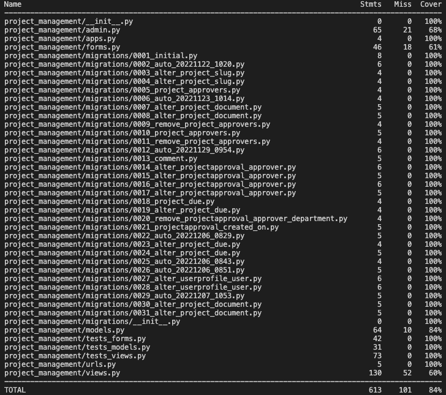  

Notification tests coverage  
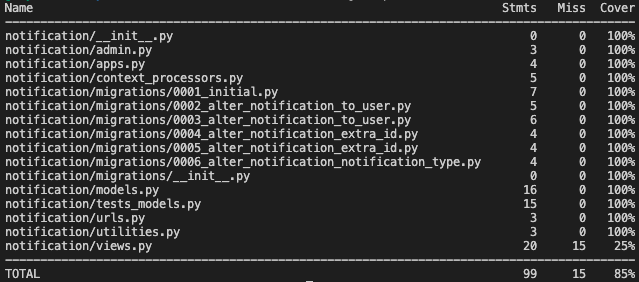  

### Manual testing

I've tested that the different functionalities of the website work as intended.

| Test Label                                                              | Test Action                                                                                                                                        | Expected Outcome                                                                                                                                                                                                                   | Test Outcome |
|-------------------------------------------------------------------------|----------------------------------------------------------------------------------------------------------------------------------------------------|------------------------------------------------------------------------------------------------------------------------------------------------------------------------------------------------------------------------------------|--------------|
| Nav / mobile nav - Logo click                                           | Click on the logo in the navigation.                                                                                                               | It redirects to the homepage (“/”).                                                                                                                                                                                                | PASS         |
| Nav – sign up                                                           | Click on sign up in the navigation.                                                                                                                | It redirects to the sign-up page “/accounts/signup/”.                                                                                                                                                                              | PASS         |
| Sign up – form validation                                               | On “/accounts/signup/” enter an incorrect form value or not enter a value (exclude the optional fields). Click sign up.                            | Sign-up will fail and a failing error will appear next to the field failed.                                                                                                                                                          | PASS         |
| Sign up - redirect                                                      | On “/accounts/signup/” complete the form and click on sign up.                                                                                     | You will be redirected to the homepage (“/”).                                                                                                                                                                                      | PASS         |
| Sign in - feedback                                                      | On “/accounts/signup/” complete the form and click on sign up.                                                                                     | After the redirect, a green feedback message will appear on the bottom left.                                                                                                                                                        | PASS         |
| Nav / mobile nav - login                                                | Click on the login in the navigation.                                                                                                                 | It redirects to the login page “/accounts/login/”.                                                                                                                                                                                 | PASS         |
| Sign in – form validation                                               | On “/accounts/login/” enter an incorrect form value or not enter a value. Click sign in.                                                           | Sign-in will fail and a failing error will appear next to the field failed.                                                                                                                                                          | PASS         |
| Sign in - redirect                                                      | On “/accounts/login/” complete the form and click on sign in.                                                                                      | You will be redirected to the homepage (“/”).                                                                                                                                                                                      | PASS         |
| Sign in - feedback                                                      | On “/accounts/login/” complete the form and click on sign in.                                                                                      | After the redirect, a green feedback message will appear on the bottom left.                                                                                                                                                        | PASS         |
| Nav / mobile nav – create a project                                     | Click on ‘Create a project' in the nav.                                                                                                            | You’ll be redirected to “/create-project”.                                                                                                                                                                                         | PASS         |
| Create a project – form validation                                      | In “/create-project” test all inputs but ‘document’ and the approvers' fields are required. Click on ‘create project’.                              | Submit will fail if you haven’t entered the required input.                                                                                                                                                                          | PASS         |
| Create a project – form validation approvers                            | In “/create-project” enter either the approver name or approval due date and click ‘create project’.                                               | Submit will fail. Both fields are required if one of the 2 is entered.                                                                                                                                                             | PASS         |
| Create a project – Add approvers                                        | In “/create-project” use the + and – buttons to add or remove as many approvers as needed.                                                         | Clicking on + will add a slot for an extra approver. Clicking on – will remove the last slot.                                                                                                                                      | PASS         |
| Create a project – form submits | In “/create-project” complete the form correctly and fully. Click ‘submit project’.                                                                | After the click, you will be redirected to the homepage. Access the admin panel to find records of the project and approvers created in the database.                                                                              | PASS         |
| Create a project - feedback                                             | In “/create-project” complete the form correctly and fully. Click ‘submit project’.                                                                | After the submission, a green feedback message will appear on the bottom left of the screen.                                                                                                                                        | PASS         |
| Create a project - notification                                         | In “/create-project” complete the form correctly and fully. Click ‘submit project’.                                                                | A notification will appear to the approvers selected.                                                                                                                                      | PASS         |
| Create a project – title test                                           | In “/create-project” create 2 projects with the same title.                                                                                        |                                                                                                                                                                                                                                    | PASS         |
| Nav / mobile nav - notification                                         | In the nav click on Notifications.                                                                                                                 | A list of notifications will appear if any.                                                                                                                                                                                        | PASS         |
| Notification                                                            | In “/notifications” click on a notification and then navigate back to “/notifications”.                                                            | The notification you have clicked on disappeared from the list because you read it already.                                                                                                                                        | PASS         |
| Nav / mobile nav – all projects                                         | In the nav click on All projects.                                                                                                                  | You are redirected to (“/”).                                                                                                                                                                                                       | PASS         |
| Nav / mobile nav – My projects                                          | In the nav click on My projects                                                                                                                    | You are redirected to (“/my-projects”).                                                                                                                                                                                            | PASS         |
| Nav / mobile nav – My approvals                                         | In the nav click on My approvals                                                                                                                   | You are redirected to (“/my-approvals.”).                                                                                                                                                                                          | PASS         |
| Nav / mobile nav – Logout                                               | In the nav click on Logout                                                                                                                         | You are asked if you are sure you want to log out.                                                                                                                                                                                  | PASS         |
| Logout                                                                  | In the nav click on Logout and confirm the logout on the second screen.                                                                            | You are logged out. You can’t see the navigation options and you can click on any buttons on the /project-details pages. You are redirected to the page “/”. A Green feedback box on the bottom left will say you have logged out. | PASS         |
| All projects – project approvers                                        | In (“/”). Click on ‘View approvers’ on any project you want.                                                                                       | The project expands and you can see all approvers and their de dates.                                                                                                                                                              | PASS         |
| All projects – view details                                             | In (“/”). Click on ‘View details on any project you want.                                                                                         | You are redirected to the project details page.                                                                                                                                                                                    | PASS         |
| All projects / My projects / My approvals – completed or approved colour | Complete or approve a project.                                                                                                                     | In “/” or “/my-approvals” or “/my-projects” the project background colour turns light green if you are signed in and you are the PM (my projects) or an approver (my-approvals)                                                     | PASS         |
| Project details                                                         | Look at any project you have created on all the pages where a project collapsed or not collapsed appears.                                           | You can always see the project id, title, owner due date, attachment (if any), completion status, approvers (if any), approvers department and approvers due date.                                                                 | PASS         |
| Project details – PM buttons                                            | Log in and click on ‘view details for a project where you are not the owner.                                                                      | You can’t click on 'edit project', 'delete project' or 'complete project'.                                                                                                                                                               | PASS         |
| Project details – PA buttons                                            | Log in and click on ‘view details' for a project where you are not a project approver.                                                             | You can’t approve the project.                                                                                                                                                                                                     | PASS         |
| Project details – complete and delete 1                                 | Log in and view the details of a project where you are the owner. Click on delete project and complete project.                                    | Defensive design will ask you to confirm your choice.                                                                                                                                                                              | PASS         |
| Project details – complete and delete 2                                 | Log in and view the details of a project where you are the owner. Click on delete project and complete project. Approve also the defensive design. | You are redirected to the ‘my-projects’ page. A green feedback message on the bottom left will indicate the completion of your action.                                                                                             | PASS         |
| Project details - edit                                                  | On any project details page, click on Edit project.                                                                                                | You’ll be redirected to a prepopulated form where you can change the project information.                                                                                                                                          | PASS         |
| Project details – edit 2                                                | Change any field you want and click on ‘create a project’                                                                                          | If you have removed a required field, you’ll get an error. If you have added or removed an approver, the database is updated.                                                                                                      | PASS         |
| Project details – edit 3                                                | Update a project you own.                                                                                                                          | A feedback message on the bottom left will say you have updated the project after the form submission.                                                                                                                             | PASS         |
| Project details – comment form                                          | On any project you want, go to the project details page, fill in and submit a comment form.                                                           | The comment submitted will appear below the comment form in chronological order from the newest to the oldest.                                                                                                                     | PASS         |
| My approvals page                                                       | Go to my approvals page                                                                                                                            | Projects are ordered by the due date. You see only projects where you are an approver. Approved projects have a green background.                                                                                                        | PASS         |
| My projects page                                                        | Go to my projects page                                                                                                                             | Projects are ordered by the last created. You see only projects where you are the owner. Completed projects have a green background.                                                                                                     | PASS         |
| Approve a project                                                       | Click on ‘view details on a project where you aren’t an approver.                                                                                 | You can’t approve.                                                                                                                                                                                                                 | PASS         |
| Approve a project 2                                                     | Click on ‘view details on a project where you are an approver. Click on ‘approve project’                                                         | Defensive design will ask you to confirm the approval.                                                                                                                                                                             | PASS         |
| Approve a project 3                                                     | Click on ‘view details on a project where you are an approver. Click on ‘approve project’. Pass the defensive design.                             | A feedback message on the bottom left will say you have approved the project. You are redirected to the /my-approvals page. The background of the project you have approved will turn light green.                                | PASS         |

### Browser compatibility

All the functionality tests have been carried out and achieved a PASS on the latest versions of the following browsers:
- Google Chrome
- Safari
- Firefox
- Microsoft Edge

### Responsiveness testing

All the functionality tests have been carried out and achieved a PASS on the following screen resolutions:
- 365x667 (iPhone SE)
- 540x720 (Surface Duo)
- 1280x800 (Nest Hub Max)
- 2560x1600 (Macbook Pro M1)

The website has also been tested for responsiveness on [https://ui.dev/amiresponsive](https://ui.dev/amiresponsive?url=https://the-checklistar.herokuapp.com/).
- [dashboard.html](./media/README-files/i-am-responsive.png)  

### User stories testing

I've tested whether the user needs have been satisfied with the features created.

|                   User stories                  | Features | Result |
|:-----------------------------------------------:|:--------:|--------|
| E1 US1 - Create a project                       | 7, 11    | PASS   |
| E1 US2 – Set the project workflow               | 7        | PASS   |
| E1 US3 – Create main dashboard                  | 2, 3     | PASS   |
| E1 US4 – Edit a project                         | 7, 11    | PASS   |
| E1 US5 – Delete a workflow                      | 3, 11    | PASS   |
| E1 US6 – See all the projects open              | 4        | PASS   |
| E1 US7 - Add a comment (Create)                 | 3, 11    | PASS   |
| E1 US8 - Notify PM                              | 6        | PASS   |
| E1 US9 - Registration and sign in project owner | 8, 9     | PASS   |
| E2 US1 - See projects pending approval (Read)   | 5        | PASS   |
| E2 US2 - See project by due date                | 5, 3     | PASS   |
| E2 US3 - Approvers feedback                     | 3        | PASS   |
| E2 US4 - Approve a project                      | 3, 11    | PASS   |
| E2 US5 - Notify approvers                       | 6,       | PASS   |
| E2 US6 - Registration and sign approvers        | 8, 9     | PASS   |
| E3 US1 - The risk controller                    | 10       | PASS   |

## Issues fixed

1. Create many to many relations and templates [Codemy](https://www.youtube.com/watch?v=H3joYTIRqKk&ab_channel=Codemy.com)
2. Automatically create slug from project title [kodnito](https://www.kodnito.com/posts/slugify-urls-django/)
3. Making 2 queries in one view (I thought I had to create 2 views in one template)[Stackoverflow](https://stackoverflow.com/questions/62704325/django-display-multiple-views-in-one-template)
4. How to submit a form and a format together [Stackoverflow](https://stackoverflow.com/questions/62704325/django-display-multiple-views-in-one-template)
5. Creating dynamic forms with JavaScript [BrennanTymrak](https://www.brennantymrak.com/articles/django-dynamic-formsets-javascript)
6. Filter a parent model based on a child model [Stackoverflow](https://stackoverflow.com/questions/28059987/how-can-filter-parent-based-on-children-in-django)
7. How to add a date picker in Django forms [Stackoverflow](https://stackoverflow.com/questions/36293061/how-to-include-datepicker-in-django-modelform)
8. Customise the default User model returned field (which is username)[Stackoverflow](https://stackoverflow.com/questions/34214320/django-customize-the-user-models-return-field)
9. If a project with an existing title is submitted, a 500 error page comes up. Solution: used clean method to handle unique title errors [Stackoverflow](https://stackoverflow.com/questions/3473165/django-unique-constraint-form-errors)
10. When a project description is added from the Admin panel, it renders with the paragraph tag. Solution: In the admin panel text editor for the project description field, the second last button in the text editor is 'Code view'. Select 'Code view' remove the tags and save. The text will render normally, without tags.
11. - Add first_name and last_name to user model from admin panel [stackoverflow](https://stackoverflow.com/questions/2552516/changing-user-modeladmin-for-django-admin)
12. - Users created from the admin panel can't log in. Solution: hash the password before saving the user.

## Known bugs

## Deployment

Below you can find all the steps to take in order to clone and deploy this application. A similar summary to setup a basic Django project and deploy it on Heroku was provided by the [Code Institute](https://codeinstitute.s3.amazonaws.com/fst/Django%20Blog%20Cheat%20Sheet%20v1.pdf).

**1. To clone the website**
1. Go to the GitHub repository [The Checklistar](https://github.com/jannis-kiriasis/the-checklistar/)
2. Open the dropdown 'Code'
3. Select the HTTPs tab
4. Copy the given url (https://github.com/jannis-kiriasis/the-checklistar.git)
5. Open 'Git Bash' on your favourite code editor and select the location where you want to save the cloned directory
6. Type `git clone https://github.com/jannis-kiriasis/the-checklistar.git` and press enter to create a local copy
7. Install the required packages by typing `pip install -r requirements.txt` in the terminal
8. In settings.py set `DEBUG=True` (Now it is set to False)
9. To push changes to the repository, type the following commands in the terminal
   - `git add .` to add changes
   - `git commit -m "Your message"`
   - `git push`

**2. To create a database with ElephantSQL**
1. Sign in with GitHub (or Sign up with GitHub) to [ElephantSQL](https://www.elephantsql.com/)
2. In the 'Instances' page click on 'Create new instance'
3. Give a name to your database, select the free 'Tiny Turtle' plan. You can leave 'tags' empty
4. Proceed to 'select region' and select the closest region to your location
5. Review and confirm your choices
6. From the dropdown menu in the navigation select the instance you have just created
7. In the 'details' view, copy the database URL

**3. Create an app on Heroku (deployment environment)**
1. Sign in (or create an account) on [Heroku](https://heroku.com/)
2. From the dashboard, click on 'Create a new app'
3. Enter a unique name and create an app
4. On the application configuration page click on "settings" (in the navigation) and then on "Reveal Config Vars"
5. Add the following Config vars keys and values:
   - 'DISABLE_COLLECTSTATIC': '1'
   - 'DATABASE_URL': 'past the database URL from ElephantSQL you have copied at point 2.7'
   - 'SECRET_KEY': 'come up with a random secret key'
6. **Back in your code editor** create a file 'env.py'
7. Add 'env.py' to the .gitignore file
8. In 'env.py' add the following code:
   - `import os`
   - `os.environ["DATABASE_URL"] = "your database URL from point 2.7"`
   - `os.environ["SECRET_KEY"] = "your secret key from point 3.5"`
9. Save
10. In 'settings.py' make sure that DATABASES and SECRET_KEY are equal to:
   - `DATABASES = {'default': dj_database_url.parse(os.environ.get('DATABASE_URL'))}`
   - `SECRET_KEY = os.environ.get('SECRET_KEY')`
11. Initialise the database with the command `python3 manage.py migrate`
12. Update the requirements.txt file with the command `pip3 freeze --local > requirements.txt`
13. Commit and push changes to GitHub (step 1.9)

**4. Host files on Cloudinary**
1. Login or create an account on [Cloudinary](https://cloudinary.com/)
2. From the dashboard, copy the "API Environment variable"
3. **On Heroku** find the Config vars (step 3.4)
4. Add the following key, value set:
   - `'CLOUDINARY_URL': 'paste your API Environment variable from step 4.2'`
5. **In your code editor** go to 'env.py' and add:
   - `os.environ["CLOUDINARY_URL"] = "your Cloudinary API Environment variable from step 4.2"`
6. Update requirements.txt (step 3.12)
7. Commit and push changes (step 1.9)

**5. Connect Heroku to GitHub**
1. **On Heroku** Go to the Application Configuration page of your application and click on the 'Deploy' tab
2. Under 'deployment method' select GitHub
3. Enter the name of the repository https://github.com/jannis-kiriasis/the-checklistar
4. Scroll down and chose automatic deployment or manual deployment then save
5. On the application configuration page click on 'Open App'.
6. Run the app https://the-checklistar.herokuapp.com/

**6. Final deployment**
1. **In 'settings.py'** set `DEBUG=False`
2. **In 'settings.py'** check if you have (or add) `X_FRAME_OPTIONS = 'SAMEORIGIN'`
3. Update requirements.txt with the command `pip3 freeze --local > requirements.txt`
4. Push to GitHub (step 1.9)
5. **On Heroku** find the Config Vars (step 3.4)
6. Remove 'DISABLE_COLLECTSTATIC': '1'
7. Deploy the app (from steps 5.4 to 5.6)

## Acknowledgements

Brian Macharia, my mentor, helped me test the website functionalities and provide excellent recommendations.

I followed this video from [Code with Stein](https://www.youtube.com/watch?v=C8pYT1R8yo4&ab_channel=CodeWithStein) to create the notifications.

I followed this article from [Brennan Tymrak](https://www.brennantymrak.com/articles/django-dynamic-formsets-javascript) to create the dynamic formset with JavaScript to create and edit a project.

I've looked at the tests run on this project from [Elaine Broche](https://github.com/elainebroche-dev/pf4-wayfarers-guided-hikes/tree/main/hikebooker) to structure my automated python testing. 

To create the README.md file I've used a previously created by me README.md [Insured README.md](https://github.com/jannis-kiriasis/insured/blob/main/README.md) and updated it as needed.
